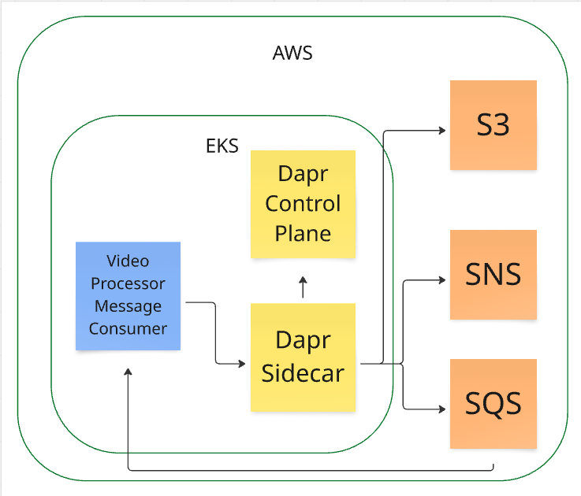
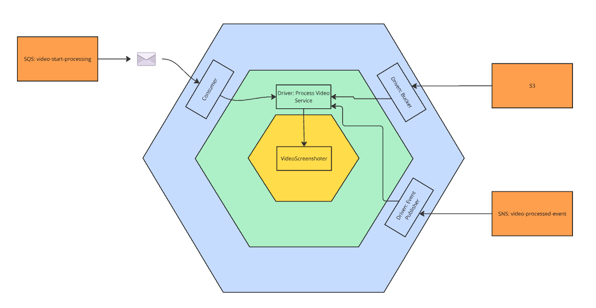

# 📦 Microserviço VideoScreenshoter

## Objetivo

Este MS implementa a regra de obtenção de screenshots do video alvo.
-  O video é obtido de um bucket (S3);
-  armazenado em um volume local;
-  Processado para obter os screenshots;
-  Compactado em um arquivo zip
-  O arquivo gerado é feito upload de volta ao S3
-  Emite evento de video processado

## Requisitos

Para rodar o sistema localmente, você precisará de:

- Uma IDE compatível, como Visual Studio, Vs code ou Rider.

## Arquitetura

O projeto utiliza o [Dapr](https://dapr.io/) para abstrair a comunicação do MS com o mundo externo. 
Portanto é necessário que o Dapr esteja instalado no cluster kubernetes ou em modo stand alone em sua máquina.



O design da aplicação segue a arquitetura hexagonal, por ser mais simples e promover o desacoplamento necessário do MS, no diagrama abaixo seguem mais detalhes de ports&adapters



O consumer recebe as requisições por meio da fila: video-start-processing 
Ativa a porta de Process Video Service que é responsável por orquestrar todos os passos necessários para concluir o processamento, incluindo o download do video pelo driven Bucket Reader, o Upload pelo driven Bucket Writer e a publicação do resultado por meio de evento no Driven: Event Publisher

Um olhar mais detalhado dos componentes e como eles se relacionam:


## Diagrama da Arquitetura de Infraestrutura


## Como Executar o Projeto Localmente

### Modo Preferencial

Utilize o .net aspire para automaticamente iniciar todos os projetos necessários como o consumer das mensagens e um projeto auxiliar que publica mensagens na fila deste consumer.


### Modo manual (mais trabalhoso)

#### Dapr

É necessário ter o client do dapr instalado, verifique se você já o tem:

> dapr --version

se não tiver, instale com:

### macOS
> brew install dapr/tap/dapr

### Windows
> choco install dapr-cli

### Linux
> wget -q https://raw.githubusercontent.com/dapr/cli/master/install/install.sh -O - | /bin/bash

### Inicie o dapr

>dapr init

### Crie os componentes necessários

Para que o projeto rode corretamente, é necessário ter componentes de acesso ao S3 e ao Sqs/Sns, portanto, adicione no diretório de componentes do Dapr os componentes abaixo:

No windows, abra o executar (win+R) e digite:
> %USERPROFILE%\.dapr\components


>s3-component.yaml

```yaml
apiVersion: dapr.io/v1alpha1
kind: Component
metadata:
  name: s3bucket # Nome do binding (usado para referenciar no código)
spec:
  type: bindings.aws.s3 # Tipo do binding
  version: v1
  metadata:
  - name: region
    value: "us-east-1" # Região padrão do LocalStack
  - name: bucket
    value: "videobucket" # Nome do bucket
  - name: endpoint
    value: "http://localhost:4566" # Endpoint do LocalStack
  - name: accessKey
    value: "test" # Credencial fictícia
  - name: secretKey
    value: "test" # Credencial fictícia
  - name: forcePathStyle
    value: "true"
```

>sns-component.yaml

```yaml
apiVersion: dapr.io/v1alpha1
kind: Component
metadata:
  name: snssqs-pubsub
  namespace: default
spec:
  type: pubsub.aws.snssqs
  version: v1
  metadata:
  - name: region
    value: "us-east-1"
  - name: accessKey
    value: "test"
  - name: secretKey
    value: "test"
auth:
  secretStore: ""
``` 

### Inicie o sidecar

```sh
dapr run \
  --app-id processing-video-consumer \
  --app-port 5148 \
  --resources-path ./components \
  --dapr-http-port 3500 \
  --dapr-grpc-port 50001 \
  -- dotnet run --project ./src/application/VideoScreenshot.MessageConsumer/VideoScreenshot.MessageConsumer.csproj
```

### Inicie o projeto

- Restaurar Dependências:
  
```sh
dotnet restore src/Application/VideoScreenshot.MessageConsumer/VideoScreenshot.MessageConsumer.csproj
```

- Compilar o projeto:

```sh
dotnet build src/Application/VideoScreenshot.MessageConsumer/VideoScreenshot.MessageConsumer.csproj -c Release --no-restore
```

- Executar testes:

```sh
dotnet test VideoScreenshotProcessor.sln -c Release --no-build --no-restore
```

## Deploy local no Cluster EKS

### Helm

O projeto utiliza [helm](https://helm.sh/) como gerenciador de pacotes. 

- Configurar Profile da AWS editando o arquivo `.aws/config`:

```sh
[profile_name]
access_key = ""
secret_key = ""
region = us-east-1
output = json
```

```sh
- Atualizar o `kubeconfig`para acesso ao Cluster:

aws eks update-kubeconfig --region (region-name) --name (cluster-name) --profile (name);
```

- Aplicar o helm:

```sh
helm upgrade --install video-screenshot-processor-release iac/helm/video-screenshot-processor  --namespace video --create-namespace --set image.tag=latest
```

- Verificar status dos pods em execução:

```sh
kubectl get pods -n video
```

## Ativação do consumer standalone

### Mensagem

O template da mensagem esperada:
```json
{
  "ProcessId": "uuid",
  "VideoName": "string"
}
```

Para que o processamento funcione corretamente, é necessário enviar na mensagem um video e ProcessId existente no S3.
O arquivo que o service irá procurar deverá ser composto pelo processId e videoName, exemplo: 0EB4FD7B-6B68-44EA-BECF-9FCF95D1D936/meu-video.mp4
O upload do arquivo compactado gerado com as imagens será feito no mesmo diretório do ProcessId.

### Localstack

Para testar localmente, sem a necessidade se se conectar na aws, recomendamos a utilização do projeto [LocalStack](https://docs.localstack.cloud/getting-started/)

Utilize o docker-compose.yaml abaixo para iniciar o localstack em sua máquina:

```yaml
version: '3.8'

services:
  localstack:
    container_name: "${LOCALSTACK_DOCKER_NAME:-localstack-main}"
    image: localstack/localstack:latest
    ports:
      - "127.0.0.1:4566:4566"            # LocalStack Gateway
    environment:
      # Limita o LocalStack a rodar apenas o SQS
      - SERVICES=s3,sqs,sns,sts
      # Ignora a verificação de saúde do S3
      #- IGNORE_SERVICES=s3
      # Habilita o modo DEBUG (opcional)
      - DEBUG=${DEBUG:-1}
      # Configura a região padrão
      - DEFAULT_REGION=us-east-1
      # Persiste dados no volume (opcional)
      - DATA_DIR=/var/lib/localstack/data
      # Habilita a UI do LocalStack (opcional)
      - LOCALSTACK_UI=1
    volumes:
      # Volume para persistência de dados
      - "${LOCALSTACK_VOLUME_DIR:-./localstack_data}:/var/lib/localstack/data"
      # Permite ao LocalStack gerenciar contêineres Docker (opcional)
      - "/var/run/docker.sock:/var/run/docker.sock"
      - "/scripts/s3-init.sh:/etc/localstack/init/ready.d/s3-init.sh"  # ready hook
    healthcheck:
      test: ["CMD", "curl", "-f", "http://localhost:4566/health"]
      interval: 10s
      timeout: 5s
      retries: 3
    restart: unless-stopped
```

[Documentação do S3 para referências](https://docs.localstack.cloud/user-guide/aws/s3/)

#### Criar S3 Bucket

> awslocal s3 mb s3://videobucket


#### Upload de arquivo

```sh
awslocal s3api put-object \
  --bucket video-bucket \
  --key 0EB4FD7B-6B68-44EA-BECF-9FCF95D1D936/meu-video.mp4 \
  --body ./path/video/meu-video.mp4
```

#### Verificação

Liste os objetos

```sh
awslocal s3api list-objects \
  --bucket video-bucket
```

## Workflows

---

### - 1.Build and Push Docker Images

- O workflow é acionado manualmente via `workflow_dispatch`.

- Realiza o checkout do repositório.

- Configura o .NET 8 no ambiente.

- Restaura dependências e compila o projeto.

- Publica o projeto .NET para a pasta app/publish.

- Faz login no Docker Hub utilizando credenciais armazenadas como secrets.

- Garante a existência da pasta certs.

- Constrói a imagem Docker com duas tags:

`latest`

`SHA do commit atual`

- Faz o push das imagens para o Docker Hub.


### - 2.Coverage Report

- Acionado automaticamente ao realizar push nas branches `main` e `feat/badge`.

- Faz checkout do repositório.

- Configura o .NET 8 no ambiente.

- Restaura dependências e compila o projeto.

- Executa os testes unitários com cobertura de código.

- Gera um badge de cobertura de código e atualiza um `Gist`.

- Instala a ferramenta `ReportGenerator`.

- Gera relatórios de cobertura em formato `HTML` e `Badges`.

- Faz upload do relatório como um artefato do `GitHub Actions`.


### - 3. Deploy To AWS EKS Cluster

- O workflow é acionado manualmente via `workflow_dispatch`.

- Faz checkout do código-fonte.

- Instala o `kubectl`.

- Instala a `AWS CLI`.

- Configura as credenciais da AWS.

- Atualiza o `kubeconfig` para acessar o cluster EKS.

- Verifica a configuração do `kubectl` e os nodes do cluster.

- Aplica os manifests Kubernetes armazenados na pasta `iac/kubernetes/`.

- Aguarda a conclusão do rollout do `deployment Pagamento-dep` no `namespace fast-order`.    


## Autores
### Fiap turma 8SOAT - Grupo 7

- André Bessa - RM357159
- Fernanda Beato - RM357346
- Felipe Bergmann - RM357042
- Darlei Randel - RM356751
- Victor Oliver - RM357451
